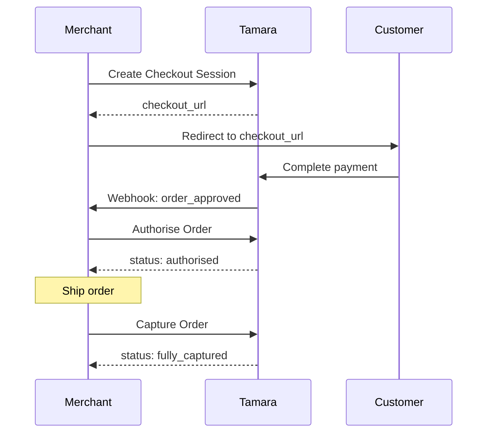

# Tamara Gateway Integration

Tamara is a Buy Now Pay Later (BNPL) provider for MENA markets (Saudi Arabia, UAE, Bahrain, Kuwait, Oman). This gateway integration supports:

- Checkout session creation with itemized cart data
- Order authorisation (required after customer approval)
- Payment capture (after shipping/fulfillment)
- Full and partial refunds
- Order cancellation (void)
- Webhook handling for order status updates

## Configuration

```typescript
import { PaymentClient } from '@abshahin/payments-sdk';

const client = new PaymentClient({
  tamara: {
    apiToken: 'your_api_token',
    notificationToken: 'your_notification_token', // For webhook JWT verification
    sandbox: true, // false for production
  },
});
```

## Payment Flow

Tamara follows a specific flow:

1. **Create Checkout Session** → Customer redirects to Tamara
2. **Customer Approval** → Customer completes payment on Tamara
3. **Authorise Order** → Merchant confirms receipt (required!)
4. **Capture Order** → After shipping/fulfillment
5. **Refund** → If customer returns items



## Creating a Checkout Session

Tamara requires itemized cart data with consumer and shipping information:

```typescript
import type { TamaraCheckoutSessionParams } from '@abshahin/payments-sdk/types/tamara.types';

const tamaraGateway = client.gateway('tamara') as TamaraGateway;

const params: TamaraCheckoutSessionParams = {
  total_amount: { amount: 300, currency: 'SAR' },
  shipping_amount: { amount: 10, currency: 'SAR' },
  tax_amount: { amount: 15, currency: 'SAR' },
  order_reference_id: 'order_123',
  order_number: 'ORD-001', // Optional, for customer display
  items: [
    {
      name: 'Product Name',
      quantity: 2,
      reference_id: 'item_1',
      type: 'Physical',
      sku: 'SKU001',
      total_amount: { amount: 275, currency: 'SAR' },
      unit_price: { amount: 137.50, currency: 'SAR' },
    },
  ],
  consumer: {
    email: 'customer@example.com',
    first_name: 'Ahmed',
    last_name: 'Mohammed',
    phone_number: '500000000',
  },
  country_code: 'SA', // SA, AE, BH, KW, OM
  description: 'Order description',
  merchant_url: {
    success: 'https://yoursite.com/success',
    failure: 'https://yoursite.com/failure',
    cancel: 'https://yoursite.com/cancel',
    notification: 'https://yoursite.com/webhook/tamara',
  },
  shipping_address: {
    city: 'Riyadh',
    country_code: 'SA',
    first_name: 'Ahmed',
    last_name: 'Mohammed',
    line1: '123 Main Street',
    phone_number: '500000000',
    region: 'Riyadh Province',
  },
  locale: 'en_US', // or 'ar_SA' for Arabic
  payment_type: 'PAY_BY_INSTALMENTS', // or 'PAY_NOW'
};

const response = await tamaraGateway.createCheckoutSession(params);

// Redirect customer to Tamara checkout
const redirectUrl = response.checkout_url;
// Store order_id for later operations
const orderId = response.order_id;
```

## Authorising Orders

**Required**: After receiving the `order_approved` webhook, you must authorise the order:

```typescript
const authResponse = await tamaraGateway.authoriseOrder(orderId);

if (authResponse.status === 'authorised') {
  // Order is confirmed, ready for fulfillment
  // If auto_captured is true, order was automatically captured
  if (authResponse.auto_captured) {
    console.log('Order auto-captured:', authResponse.capture_id);
  }
}
```

> ⚠️ **Important**: Orders left in `approved` status indicate a synchronization issue. Always authorise orders promptly.

## Capturing Payments

After shipping or fulfilling the order, capture the payment:

```typescript
import type { TamaraCaptureParams } from '@abshahin/payments-sdk/types/tamara.types';

const captureParams: TamaraCaptureParams = {
  order_id: orderId,
  total_amount: { amount: 300, currency: 'SAR' },
  shipping_info: {
    shipped_at: new Date().toISOString(),
    shipping_company: 'Aramex',
    tracking_number: 'TRACK123',
    tracking_url: 'https://aramex.com/track/TRACK123',
  },
  // Optional: itemized capture for partial captures
  items: [
    {
      name: 'Product Name',
      quantity: 2,
      reference_id: 'item_1',
      type: 'Physical',
      sku: 'SKU001',
      total_amount: { amount: 275, currency: 'SAR' },
    },
  ],
};

const captureResult = await tamaraGateway.captureTamara(captureParams);

console.log('Capture ID:', captureResult.capture_id);
console.log('Status:', captureResult.status); // 'fully_captured' or 'partially_captured'
```

> 📝 **Note**: If an order is not captured within 21 days, Tamara will auto-capture it.

## Processing Refunds

Use simplified refund after order is captured:

```typescript
import type { TamaraRefundParams } from '@abshahin/payments-sdk/types/tamara.types';

const refundParams: TamaraRefundParams = {
  order_id: orderId,
  total_amount: { amount: 100, currency: 'SAR' }, // Refund amount
  comment: 'Customer return requested',
  merchant_refund_id: 'ref_internal_123', // Optional
};

const refundResult = await tamaraGateway.refundTamara(refundParams);

console.log('Refund ID:', refundResult.refund_id);
console.log('Status:', refundResult.status); // 'fully_refunded' or 'partially_refunded'
```

## Cancelling Orders

Cancel an authorised order before capture:

```typescript
import type { TamaraCancelParams } from '@abshahin/payments-sdk/types/tamara.types';

const cancelParams: TamaraCancelParams = {
  order_id: orderId,
  total_amount: { amount: 300, currency: 'SAR' },
};

const cancelResult = await tamaraGateway.cancelTamara(cancelParams);

console.log('Status:', cancelResult.status); // 'canceled' or 'updated' (partial)
```


## Void Payment (Standard)

You can also use the standard `voidPayment` method to cancel an order.

```typescript
const result = await client.voidPayment('tamara', {
  gatewayPaymentId: orderId,
});
```

## Get Payment Details

Retrieve the latest status of an order.

```typescript
const payment = await client.getPayment('tamara', {
  gatewayPaymentId: orderId,
});

console.log(payment.status); // 'authorized', 'paid', etc.
```

## Handling Webhooks

Tamara sends webhooks for order status changes. Configure your webhook URL in the Tamara Partners Portal.

```typescript
// In your webhook handler
app.post('/webhook/tamara', async (req) => {
  const tamaraToken = req.query.tamaraToken ?? req.headers.authorization;
  
  // Verify webhook using async cryptographic verification (recommended for production)
  const isValid = await tamaraGateway.verifyWebhookAsync(req.body, tamaraToken);
  if (!isValid) {
    return { status: 401, message: 'Invalid signature' };
  }

  // Parse event
  const event = tamaraGateway.parseWebhookEvent(req.body);

  switch (event.type) {
    case 'order_approved':
      // Customer completed payment - authorise immediately!
      await tamaraGateway.authoriseOrder(event.gatewayPaymentId);
      break;
    
    case 'order_authorised':
      // Order confirmed, ready to fulfill
      break;
    
    case 'order_captured':
      // Payment settled
      break;
    
    case 'order_refunded':
      // Refund processed
      break;
    
    case 'order_canceled':
      // Order cancelled
      break;
    
    case 'order_declined':
    case 'order_expired':
      // Payment failed
      break;
  }

  return { status: 200 };
});
```

### Webhook Verification

Tamara sends a JWT token (`tamaraToken`) with each webhook. The token is sent:
- As a query parameter: `?tamaraToken=xxx`
- In the Authorization header: `Bearer xxx`

Configure `notificationToken` in your gateway config to enable JWT verification.

**Two verification methods available:**

| Method | Use Case | Cryptographic Verification |
|--------|----------|---------------------------|
| `verifyWebhook()` | Sync, development | ❌ Basic structure check only |
| `verifyWebhookAsync()` | **Production** | ✅ Full HS256 signature verification |

```typescript
// ✅ Recommended for production - full JWT signature verification
const isValid = await tamaraGateway.verifyWebhookAsync(payload, tamaraToken);

// ⚠️ Development only - does NOT verify signature cryptographically
const isValid = tamaraGateway.verifyWebhook(payload, tamaraToken);
```

> ⚠️ **Important**: Always use `verifyWebhookAsync()` in production to prevent webhook forgery.

## Status Mapping

| Tamara Status | SDK Status |
|--------------|------------|
| `new` | `pending` |
| `approved` | `pending` |
| `authorised` | `authorized` |
| `fully_captured` | `paid` |
| `partially_captured` | `paid` |
| `fully_refunded` | `refunded` |
| `partially_refunded` | `partially_refunded` |
| `canceled` | `cancelled` |
| `declined` | `failed` |
| `expired` | `failed` |

## Supported Countries & Currencies

| Country | Code | Currency |
|---------|------|----------|
| Saudi Arabia | SA | SAR |
| UAE | AE | AED |
| Bahrain | BH | BHD |
| Kuwait | KW | KWD |
| Oman | OM | OMR |

## Error Handling

```typescript
import { 
  InvalidRequestError, 
  AuthenticationError,
  GatewayApiError,
  NetworkError 
} from '@abshahin/payments-sdk';

try {
  await tamaraGateway.createCheckoutSession(params);
} catch (error) {
  if (error instanceof InvalidRequestError) {
    // Validation error - check params
    console.log('Validation errors:', error.details);
  } else if (error instanceof AuthenticationError) {
    // Invalid API token
  } else if (error instanceof GatewayApiError) {
    // Tamara API error
    console.log('Raw error:', error.rawError);
  } else if (error instanceof NetworkError) {
    // Network failure
  }
}
```

## Best Practices

1. **Always authorise promptly**: Call `authoriseOrder()` immediately when receiving `order_approved` webhook
2. **Capture after shipping**: Only capture orders that have been shipped/fulfilled
3. **Handle partial operations**: Tamara supports partial captures and refunds
4. **Store order_id**: Save Tamara's `order_id` in your database for all operations
5. **Verify webhooks**: Configure `notificationToken` for production security
